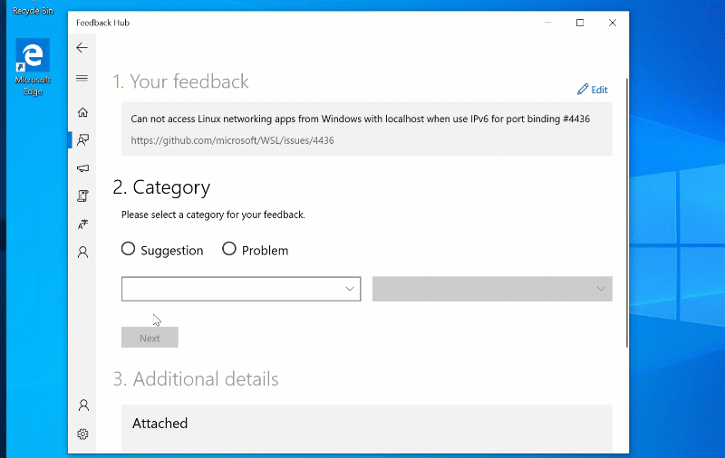
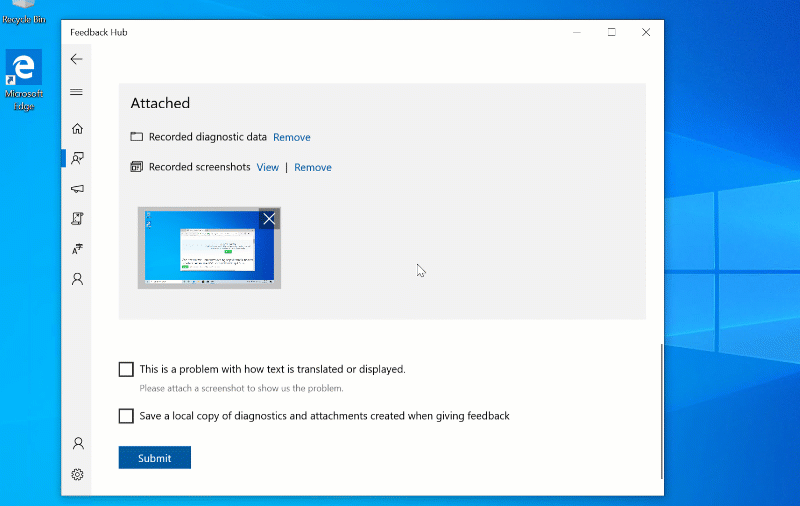

Please provide as much information as possible when reporting a bug or filing an issue on the Windows Subsystem for Linux.

## Important: Reporting BSODs and Security issues
**Do not open Github issues for Windows crashes (BSODs) or security issues.**. Instead, send Windows crashes or other security-related issues to secure@microsoft.com.

## Reporting issues in Windows Console or WSL text rendering/user experience
Note that WSL distro's launch in the Windows Console (unless you have taken steps to launch a 3rd party console/terminal). Therefore, *please file UI/UX related issues in the [Windows Console issue tracker](https://github.com/microsoft/console)*.

## Reporting issues in WSL
A well written bug will follow the following template:

### 1) Issue Title
A title succinctly describing the issue.

#### Example:
`Traceroute not working.`

### 2) Windows version / build number
Your Windows build number.  This can be gathered from the CMD prompt using the `ver` command.

```
C:\> ver
Microsoft Windows [Version 10.0.14385]
```

Note: The Windows Insider builds contain many updates and fixes. If you are running on the Creators Update (10.0.15063) please check to see if your issue has been resolved in a later build.  If you are running on the Anniversary Update (10.0.14393), please try updating to the Creators Update.

#### Example:

`Microsoft Windows [Version 10.0.16170]`

### 3) Steps required to reproduce

Should include all packages and environmental variables as well as other required configuration.

#### Example:

`$ sudo apt-get install traceroute && traceroute www.microsoft.com`

### 4) Copy of the terminal output

#### Example:

```
$ traceroute www.microsoft.com
traceroute to www.microsoft.com (23.75.239.28), 30 hops max, 60 byte packets
setsockopt IP_MTU_DISCOVER: Invalid argument
```

### 5) Expected Behavior

What was the expected result of the command?  Include examples / documentation if possible.

### 6) Strace of the failing command

Run the failing command under [strace](http://manpages.ubuntu.com/manpages/wily/man1/strace.1.html).  Normal command structure is:

```
$ strace -ff <command>
```

> Note: `strace` can produce lengthy output. If the generated trace is more than about 20 lines please paste this into a [Gist](https://gist.github.com/) or another paste service and link in the bug.

#### Example:

```
$ strace traceroute www.microsoft.com
execve("/usr/bin/traceroute", ["traceroute", "www.microsoft.com"], [/* 22 vars */]) = 0
brk(0)                                  = 0x7fffdd3bc000
access("/etc/ld.so.nohwcap", F_OK)      = -1 ENOENT (No such file or directory)
mmap(NULL, 8192, PROT_READ|PROT_WRITE, MAP_PRIVATE|MAP_ANONYMOUS, -1, 0) = 0x7f1f4e820000
access("/etc/ld.so.preload", R_OK)      = -1 ENOENT (No such file or directory)
...
...
...
```

### 7) Additional information

Some bugs require additional information such as scripts to reproduce.  Please add to this section.

If there are files required, email the files to InsiderSupport@microsoft.com with:

* **Subject**:  Forward to WSL Team - RE: github issue <issue #>
* **Body**:  "Please forward to WSL Team" and include your attachment.

Common files are:

* Memory dumps found under C:\Windows\MEMORY.DMP
* Additional strace logs if the error occurs within a fork. The following
  command generates an output file for every fork created:

```
$ strace -ff -o <outputfile> <command>
```

### 8) Detailed Logs
Some bugs will require more detailed logs to help determine the cause.  There is a command to start detailed logging and another to stop.  The logs are generated locally into the working directory.

#### Start collecting logs

```
logman.exe create trace lxcore_kernel -p "{0CD1C309-0878-4515-83DB-749843B3F5C9}" -mode 0x00000008 -ft 10:00 -o .\lxcore_kernel.etl -ets
logman.exe create trace lxcore_user -p "{D90B9468-67F0-5B3B-42CC-82AC81FFD960}" -ft 1:00 -rt -o .\lxcore_user.etl -ets
logman.exe create trace lxcore_service -p "{B99CDB5A-039C-5046-E672-1A0DE0A40211}" -ft 1:00 -rt -o .\lxcore_service.etl -ets
```

#### Stop collecting logs

```
logman.exe stop lxcore_kernel -ets
logman.exe stop lxcore_user -ets
logman.exe stop lxcore_service -ets
```

#### Generated log files

The files generated will be in the directory where the above commands ran.  The files will be named:

```
lxcore_kernel.etl
lxcore_service.etl
lxcore_user.etl
```

#### Submitting logs

To submit the details logs, attach them to your GitHub issue.

### 9) Networking Logs
For bugs that are related to networking, you can provide networking logs using the Feedback hub with the following steps.

#### Open Feedback Hub and enter the title and description of your issue

- Open Feedback hub and create a new issue by pressing `Windows Key + F` on your keyboard. 
- Enter in the details of your issue:
   - In `Summarize your feedback` copy and paste in the title of your Github Issue
   - In `Explain in more detail` copy and paste a link to your Github Issue


#### Choose the WSL category 

- Select that your issue is a `Problem`
- Choose the `Developer Platform` category and the `Windows Subsystem for Linux` subcategory



#### Recreate your problem in the 'Additional Details' section

- Select 'Other' under 'Which of the following best describes your problem'
- Click 'Recreate My Problem' under 'Attachments
- Ensure that `Include Data About:` is checked to 'Windows Subsystem for Linux' 
- 'Click Start Recording' to start collecting logs
- Recreate your problem
- Click 'Stop Recording'


#### Check your attachments and submit

- Verify your recording is attached and whether you would like to send the screenshot that is automatically attached
- Hit Submit
- Get a link to your feedback item by clicking on 'Share my Feedback' and post that link to the Github thread so we can easily get to your feedback!


