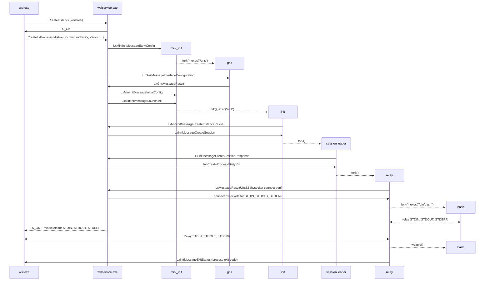

# The WSL2 boot process

This page describes the steps in the WSL2 process, from the user invoking [wsl.exe](wsl.exe.md) to the user's Linux shell (bash in this example), in the WSL2 distribution.

## Overview 

The below diagram shows the sequence of events to start bash within a WSL2 distribution. See [WSL architecture](index.md) for details about what each process does.

## CreateInstance()

When [wslservice.exe](wslservice.exe.md) receives the CreateInstance() call via COM, it will:

1) Identify which distribution the user wants to create. This is done by looking up the `DistributionRegistration` (see `src/windows/service/exe/DistributionRegistration.cpp`) in the Windows registry, matching either on the distribution ID, or using the default if none is provided.

2) Based on the type of distribution (WSL1 or WSL2), either create a WSL1 instance, or start up a WSL2 virtual machine.

3) Associate the newly creating distribution to the calling process (see `src/windows/service/exe/Lifetime.cpp`)

## Starting the WSL2 virtual machine

To start a WSL2 distribution, [wslservice.exe](wslservice.exe.md) needs a virtual machine. If the virtual machine isn't already running, it will be created as part of the `CreateInstance()` call. 

The WSL2 virtual machine is created via the [Host Compute System (HCS) service](https://learn.microsoft.com/virtualization/api/hcs/overview) (see `src/windows/service/exe/WslCoreVm.cpp`).

To create a new virtual machine, [wslservice.exe](wslservice.exe.md) generates a JSON string, which describes the virtual machine configuration. This JSON is then passed to [HcsCreateComputeSystem()](https://learn.microsoft.com/virtualization/api/hcs/reference/hcscreatecomputesystem) to create a new virtual machine.

See `src/windows/common/hcs_schema.h` for more details on the HCS JSON schema.

Part of the JSON configuration includes:

- The kernel: WSL will use its built-in kernel, usually installed `C:/Program Files/WSL/tools/kernel`, or a custom kernel if overridden via [.wslconfig](https://learn.microsoft.com/windows/wsl/wsl-config)
- The initramfs: WSL uses its own initramfs (usually installed in `C:\Program Files\WSL\tools\initrd.img`). It's an image that only contains the [mini_init](mini_init.md) binary
- The resources accessible to the virtual machine such as CPU, RAM, GPU, etc

When started, the virtual machine will boot into the provided kernel, and then execute [mini_init](mini_init.md).

## The Linux boot process

[mini_init](mini_init.md) is the process that performs usermode initialization inside the virtual machine. After performing various configurations, `mini_init` receives a `LxMiniInitMessageEarlyConfig` message from the [wslservice.exe](wslservice.exe.md) which contains the following information: 

- Identifiers for the system VHD, swap VHD and kernel modules VHD if any
- The machine's hostname
- The configured memory reclaim mode and page reporting order

[mini_init](mini_init.md) then creates the [gns process](gns.md), which is responsible for networking configuration and then receives a `LxMiniInitMessageInitialConfig` message, which contains: 

- An entropy buffer, to seed the virtual machine's entropy
- Information about the GPU drivers shares to mount, if any
- Whether [wslg](https://github.com/microsoft/wslg) is enabled

After applying all the configuration requested by [wslservice.exe](wslservice.exe.md), the virtual machine is ready to start Linux distributions.

## Starting a Linux distribution

To start a new distribution, [wslservice.exe](wslservice.exe.md) sends a `LxMiniInitMessageLaunchInit` message to [mini_init](mini_init.md), which then mounts the distribution vhd and starts [init](init.md). See ([init](init.md) for more details on WSL2 distributions configuration)

Once running, [wslservice.exe](wslservice.exe.md) can then send a `LxInitMessageCreateSession` message to start a new [session leader](session-leader.md) inside that distribution, which can be used to launch linux processes

## Relaying the linux process's input and output to Windows

Once the user's linux process has been created, [wslservice.exe](wslservice.exe.md) can return from `CreateLxProcess()` back to [wsl.exe](wsl.exe.md). In the case of WSL2, [wsl.exe](wsl.exe.md) receives the following HANDLES: 

- STDIN
- STDOUT
- STDERR
- Control channel
- Interop channel

The `STDIN`, `STDOUT` and `STDERR` handles are used to relay input and output from the Linux process to the Windows terminal. Depending on the type of handle (terminal, pipe, file, ...), [wsl.exe](wsl.exe.md) will apply different relaying logics (see `src/windows/common/relay.cpp`) to achieve the best compatibility between Windows & Linux. 

The `Control channel` is used to notify the linux process of a change in the terminal (for instance when [wsl.exe's](wsl.exe.md) terminal window is resized) so these changes can be applied to the Linux process as well. 

The `Interop channel` has two usages: 

- Create Windows processes from Linux (see [interop](interop.md))
- Notify [wsl.exe](wsl.exe.md) when the Linux process has exited (see `LxInitMessageExitStatus`)

Once the Linux process has exited, [wsl.exe](wsl.exe.md) flushes all remaining IO, and exits with the same exit code as the Linux process. 

If [wsl.exe](wsl.exe.md) is terminated before the Linux process exits, [wslhost.exe](wslhost.exe.md) will take over the `Interop channel` and continue to handle requests to execute Windows processes.