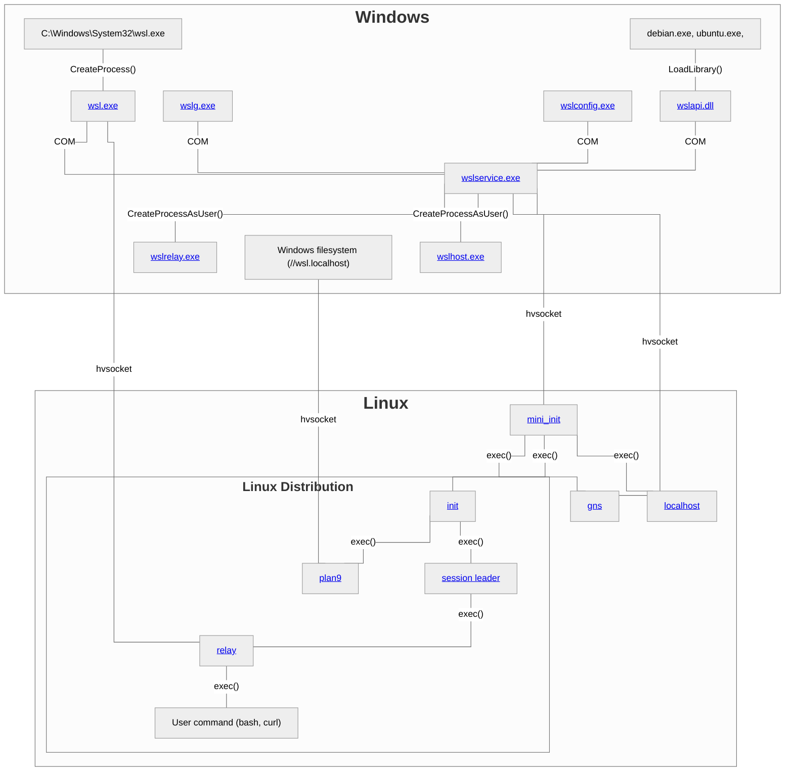

# WSL Overview

WSL is comprised of a set of executables, API's and protocols. This page offers an overview of the different components, and how they're connected.
Click on any component to get more details.

