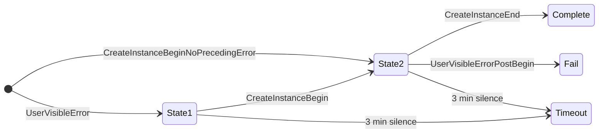
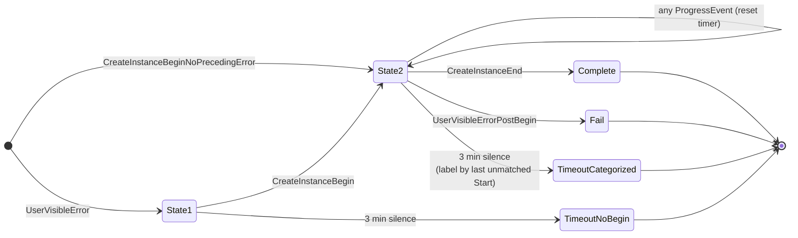

# Telemetry State Machine Updates

Backend changes required to consume the new TraceLogging **Activity** (Start/Stop) events added to `CreateInstance`. Without these changes, the new events are ignored and the existing `timeout` bucket does not shrink.

## Problem

Today the backend classifies each `CreateInstance` attempt using a 2-state machine driven by three events and one silence timer:

- `CreateInstanceBegin` (or `CreateInstanceBeginNoPrecedingError`) — transitions into state 2
- `CreateInstanceEnd` → **complete**
- `UserVisibleErrorPostBegin` → **fail**
- 3 min silence (no event) → **timeout**

The `timeout` bucket mixes two very different failures:

- **Real hangs** — code stuck in an `INFINITE`-timeout receive / plugin callback.
- **Slow but successful** — startup eventually succeeds past the 3-min window (e.g. HNS takes 3+ min).

Both collapse into the same opaque label, making triage impossible.

## New events

The client PR adds 15 TraceLogging **Activity** pairs between `CreateInstanceBegin` and `CreateInstanceEnd`. Each pair shares a single event name and a per-invocation `ActivityId` GUID; the **Start** event has `Opcode == 1` and the **Stop** event has `Opcode == 2`. All carry `PDT_ProductAndServicePerformance`, key identifiers (`vmId` / `distroName` / `instanceId`), and the Stop variant carries an `hr` HRESULT for error attribution.

| Phase | Activity name | Typical cause of hang |
|---|---|---|
| VM lifecycle | `HcsCreateSystem`, `HcsStartSystem` | HCS service unresponsive |
| VM boot | `WaitForMiniInitConnect`, `ReadGuestCapabilities` | Kernel boot / hvsocket broken |
| Networking | `ConfigureNetworking`, `CreateNatNetwork` | HNS slow (common false-positive source) |
| VM finalize | `InitializeGuest` | Guest config message stuck |
| Instance disk | `AttachDistroVhd` | VHD attach on bad / BitLocker storage |
| Instance launch | `SendLaunchInit`, `WaitForInitDaemonConnect` | hvsocket write / guest init start |
| Instance init | `WaitForCreateInstanceResult` | ext4 mount / journal recovery |
| Instance init | `WaitForDrvFsInit` | Plan9 / virtiofs setup |
| Instance init | `WaitForInitConfigResponse` | systemd startup |
| Plugins | `PluginOnVmStarted`, `PluginOnDistributionStarted` | 3rd-party plugin (e.g. Docker Desktop) |

## Required backend changes

### 1. Join Start and Stop by (EventName, ActivityId), not event name alone

Start and Stop share the same `EventName`, distinguished by `Opcode` (1 vs 2). Queries must include `Opcode` in the filter or projection, and pair Start with Stop on `ActivityId`. A Start without a matching Stop on the same `ActivityId` is the signal of a silent hang for that phase.

### 2. Reset the 3-min timer on any progress event (required)

All 30 new events (15 Starts + 15 Stops) must be registered as **progress events**. Receiving any of them in state 2 resets the 3-min silence timer without transitioning state.

### 3. Split the timeout bucket by last Start without matching Stop (required)

When state 2 times out, emit a sub-label based on the last `Start` observed whose `ActivityId` has no matching `Stop`.

Mapping from last `Start` (no matching Stop on the same `ActivityId`) → timeout sub-label:

| Last unmatched Start | Timeout sub-label | Root cause |
|---|---|---|
| *(none)* | `Timeout_EarlyHang` | Stuck before any VM work |
| `HcsCreateSystem` | `Timeout_HcsCreate` | HCS service unresponsive |
| `HcsStartSystem` | `Timeout_HcsStart` | HCS start hung |
| `WaitForMiniInitConnect` | `Timeout_KernelBoot` | Kernel / hvsocket broken |
| `ReadGuestCapabilities` | `Timeout_GuestCaps` | mini_init not responding |
| `ConfigureNetworking` (no `CreateNatNetwork` in flight) | `Timeout_NetworkConfig` | GNS or other net init |
| `CreateNatNetwork` | `Timeout_Hns` | HNS slow / wedged (often false positive) |
| `InitializeGuest` | `Timeout_InitializeGuest` | Guest config stuck |
| `AttachDistroVhd` | `Timeout_AttachVhd` | VHD attach failed |
| `SendLaunchInit` | `Timeout_SendLaunchInit` | hvsocket write stuck |
| `WaitForInitDaemonConnect` | `Timeout_InitDaemonConnect` | init not coming up |
| `WaitForCreateInstanceResult` | `Timeout_InitMount` | ext4 mount / journal recovery |
| `WaitForDrvFsInit` | `Timeout_DrvFs` | Plan9 / virtiofs setup |
| `WaitForInitConfigResponse` | `Timeout_InitConfigResp` | systemd startup stuck |
| `PluginOnVmStarted` | `Timeout_PluginOnVm` | (attach `Plugin` name) |
| `PluginOnDistributionStarted` | `Timeout_PluginOnDistribution` | (attach `Plugin` name) |

### 4. Exception safety — `hr != S_OK` is not a hang

The client uses `WslTelemetryActivityScope` RAII so a Stop event is always emitted, even on exception. The backend should treat this as three distinct outcomes:

| Observed | Meaning |
|---|---|
| `Start` + `Stop` with `hr == S_OK` | Step succeeded |
| `Start` + `Stop` with `hr != S_OK` | Step failed, error surfaced — **not** a hang |
| `Start` with no matching `Stop` on same `ActivityId` | Real silent hang → feeds timeout categorization |
