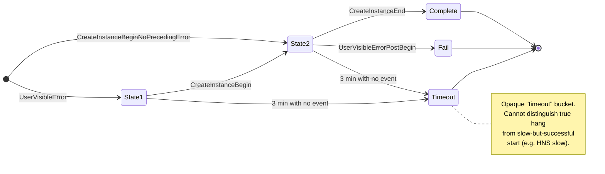
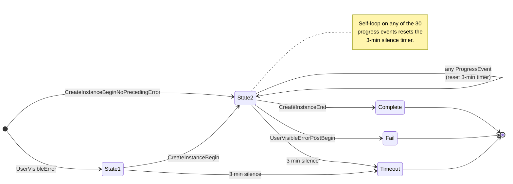
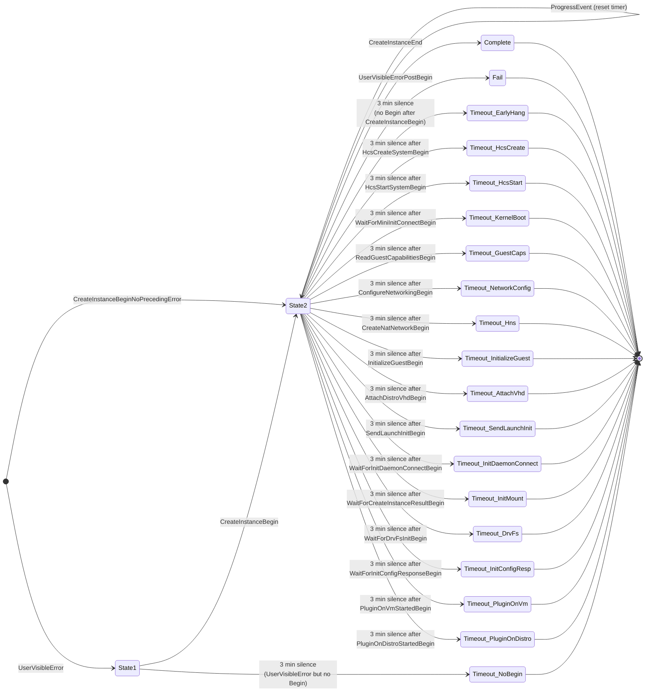
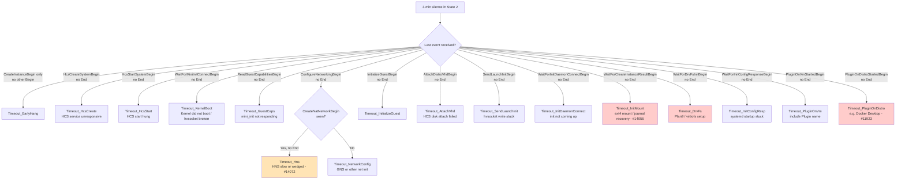
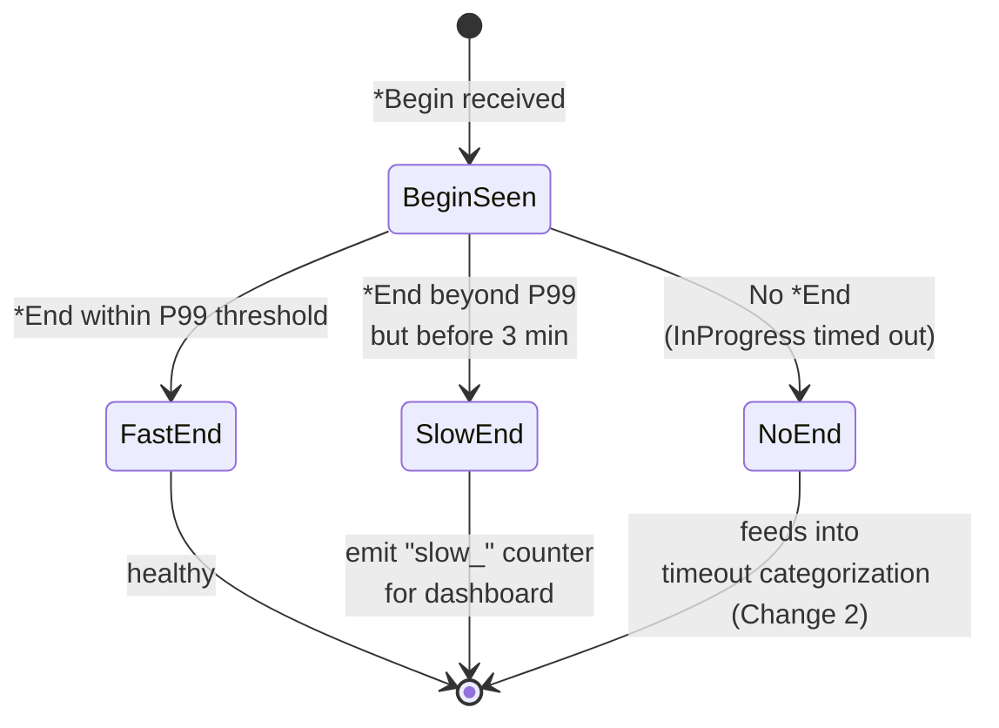
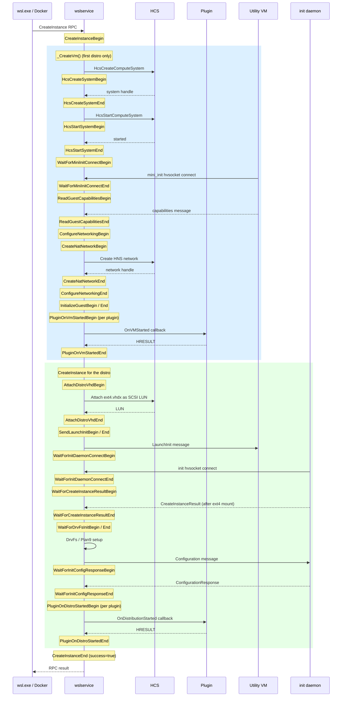
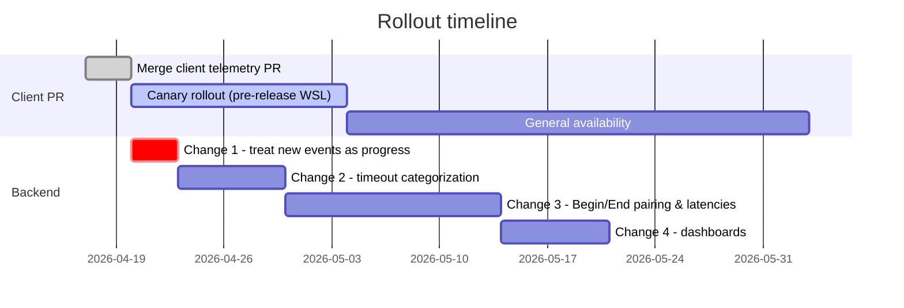

# Telemetry State Machine Updates for CreateInstance Timeout Diagnosis

This document describes the backend state-machine changes required to consume the new telemetry events added by [PR: Add Begin/End telemetry around long-wait create-instance steps](../../src/windows/service/exe/WslCoreVm.cpp).

Without these backend changes, the new events will be ignored and the existing silent-timeout bucket in telemetry will not shrink.

---

## Background

The telemetry backend currently uses a small state machine driven by three events to classify a `CreateInstance` attempt:

| Event | Emitted by |
|---|---|
| `CreateInstanceBegin` | `LxssUserSession.cpp:2511` — start of distro creation |
| `CreateInstanceEnd` | `LxssUserSession.cpp:2521` — via `wil::scope_exit_log`, fires on scope exit |
| `UserVisibleError` | emitted by `THROW_HR_WITH_USER_ERROR` / `EMIT_USER_WARNING` macros |

If `CreateInstanceBegin` arrives but neither `CreateInstanceEnd` nor `UserVisibleError` arrives within **3 minutes**, the session is classified as `timeout`. Today this bucket contains both:

1. **True hangs** — the service is stuck inside an `INFINITE`-timeout receive or a third-party plugin callback, and never produces any follow-up event.
2. **False positives** — startup is slow but eventually succeeds (e.g. HNS takes > 3 min to come up); `CreateInstanceEnd` does fire, just after the timer has already expired.

Both map to the same opaque `timeout` label, making it impossible to triage.

The client-side PR adds **15 Begin/End event pairs** between `CreateInstanceBegin` and `CreateInstanceEnd` to make each long-wait step visible to telemetry. The backend must now be updated to consume them.

---

## Current state machine

The backend currently classifies each session using a 2-state machine with four terminal buckets. Key transitions:

- From `start`, a session enters **state 1** on `UserVisibleError`, or jumps directly to **state 2** on `CreateInstanceBeginNoPrecedingError` (semantic label for a `CreateInstanceBegin` received with no prior error).
- From **state 1**, a subsequent `CreateInstanceBegin` moves the session to **state 2**.
- **State 2** is the waiting state. It resolves to one of three buckets:
  - `CreateInstanceEnd` → **complete** (success)
  - `UserVisibleErrorPostBegin` → **fail** (error surfaced to user after begin)
  - 3 min silence → **timeout** (no further events received)
- **State 1** can also transition directly to **timeout** if `CreateInstanceBegin` never arrives.



The telemetry screenshot that motivated this work shows two variants of the timeout path:

- `CreateInstanceBeginNoPrecedingError → 2 → timeout → timeout` — session went directly from start to state 2, then timed out.
- `UserVisibleError → 1 → CreateInstanceBegin → 2 → timeout → timeout` — session saw a user-visible error first, then a `CreateInstanceBegin` (likely a retry), then timed out.

Both variants currently collapse into the same single `timeout` bucket.

---

## New events introduced by the PR

All events are emitted with `PDT_ProductAndServicePerformance` privacy tag and carry at least `vmId` / `distroName` / `instanceId` where applicable.

| Phase | Begin event | End event | Key payload fields |
|---|---|---|---|
| VM lifecycle | `HcsCreateSystemBegin` | `HcsCreateSystemEnd` | `vmId` |
| VM lifecycle | `HcsStartSystemBegin` | `HcsStartSystemEnd` | `vmId` |
| VM boot | `WaitForMiniInitConnectBegin` | `WaitForMiniInitConnectEnd` | `vmId`, `timeoutMs` |
| VM boot | `ReadGuestCapabilitiesBegin` | `ReadGuestCapabilitiesEnd` | `vmId`, `kernelVersion` |
| Networking | `ConfigureNetworkingBegin` | `ConfigureNetworkingEnd` | `vmId`, `networkingMode`, `finalNetworkingMode`, `result` |
| Networking | `CreateNatNetworkBegin` | `CreateNatNetworkEnd` | `vmId`, `success` |
| VM finalization | `InitializeGuestBegin` | `InitializeGuestEnd` | `vmId` |
| Instance disk | `AttachDistroVhdBegin` | `AttachDistroVhdEnd` | `instanceId`, `distroName`, `lun` |
| Instance launch | `SendLaunchInitBegin` | `SendLaunchInitEnd` | `instanceId`, `distroName` |
| Instance launch | `WaitForInitDaemonConnectBegin` | `WaitForInitDaemonConnectEnd` | `instanceId`, `distroName`, `timeoutMs` |
| Instance init | `WaitForCreateInstanceResultBegin` | `WaitForCreateInstanceResultEnd` | `instanceId`, `distroName`, `initResult`, `failureStep` |
| Instance init | `WaitForDrvFsInitBegin` | `WaitForDrvFsInitEnd` | `instanceId`, `distroName`, `drvfsMount` |
| Instance init | `WaitForInitConfigResponseBegin` | `WaitForInitConfigResponseEnd` | `instanceId`, `distroName` |
| Plugins | `PluginOnVmStartedBegin` | `PluginOnVmStartedEnd` | `Plugin` (name), `Sid`, `result` |
| Plugins | `PluginOnDistroStartedBegin` | `PluginOnDistroStartedEnd` | `Plugin`, `Sid`, `DistributionId`, `result` |

---

## Required backend changes

### Change 1 — Treat new events as progress signals (P0, required)

The 3-minute timeout timer currently only resets on `CreateInstanceEnd` or `UserVisibleErrorPostBegin`. It must additionally reset whenever **any** of the new progress events arrives in state 2. This keeps the existing state graph shape (state 1 / state 2 / complete / fail / timeout) but makes state 2 tolerant of long-running but progressing sessions.

Without this change, the backend continues to classify slow-but-successful sessions as `timeout`, exactly like today.



The new self-loop on state 2 consumes any of the 30 progress events without advancing to a terminal bucket — it only resets the silence timer.

The full list of events that reset the timer:

```
# Terminal events (drive state transitions out of InProgress)
CreateInstanceEnd
UserVisibleError

# Progress events (reset 3-min timer, stay in InProgress)
HcsCreateSystemBegin              HcsCreateSystemEnd
HcsStartSystemBegin               HcsStartSystemEnd
WaitForMiniInitConnectBegin       WaitForMiniInitConnectEnd
ReadGuestCapabilitiesBegin        ReadGuestCapabilitiesEnd
ConfigureNetworkingBegin          ConfigureNetworkingEnd
CreateNatNetworkBegin             CreateNatNetworkEnd
InitializeGuestBegin              InitializeGuestEnd
AttachDistroVhdBegin              AttachDistroVhdEnd
SendLaunchInitBegin               SendLaunchInitEnd
WaitForInitDaemonConnectBegin     WaitForInitDaemonConnectEnd
WaitForCreateInstanceResultBegin  WaitForCreateInstanceResultEnd
WaitForDrvFsInitBegin             WaitForDrvFsInitEnd
WaitForInitConfigResponseBegin    WaitForInitConfigResponseEnd
PluginOnVmStartedBegin            PluginOnVmStartedEnd
PluginOnDistroStartedBegin        PluginOnDistroStartedEnd
```

---

### Change 2 — Split the timeout bucket by last Begin event (P0, high diagnostic value)

Instead of a single `timeout` terminal, emit a sub-label derived from the last `*Begin` event observed in state 2 for which no matching `*End` arrived. The 3-min silence transition still leads to a timeout, but the bucket is now attributable to a specific stage.

This is expressed as an expansion of the **timeout** terminal: the same state-graph shape, but `Timeout` fans out into multiple labeled outcomes.



Classification logic (applied at 3-min silence detection):



The mapping from `last Begin event` to terminal label is a simple lookup:

| Last Begin (no matching End) | Terminal label |
|---|---|
| none (just `CreateInstanceBegin`) | `Timeout_EarlyHang` |
| `HcsCreateSystemBegin` | `Timeout_HcsCreate` |
| `HcsStartSystemBegin` | `Timeout_HcsStart` |
| `WaitForMiniInitConnectBegin` | `Timeout_KernelBoot` |
| `ReadGuestCapabilitiesBegin` | `Timeout_GuestCaps` |
| `ConfigureNetworkingBegin` (no `CreateNatNetworkBegin`) | `Timeout_NetworkConfig` |
| `CreateNatNetworkBegin` | `Timeout_Hns` |
| `InitializeGuestBegin` | `Timeout_InitializeGuest` |
| `AttachDistroVhdBegin` | `Timeout_AttachVhd` |
| `SendLaunchInitBegin` | `Timeout_SendLaunchInit` |
| `WaitForInitDaemonConnectBegin` | `Timeout_InitDaemonConnect` |
| `WaitForCreateInstanceResultBegin` | `Timeout_InitMount` |
| `WaitForDrvFsInitBegin` | `Timeout_DrvFs` |
| `WaitForInitConfigResponseBegin` | `Timeout_InitConfigResp` |
| `PluginOnVmStartedBegin` | `Timeout_PluginOnVm` (+ `plugin_name`) |
| `PluginOnDistroStartedBegin` | `Timeout_PluginOnDistro` (+ `plugin_name`) |

**Plugin timeouts** additionally carry the `Plugin` field from the event payload so dashboards can aggregate by specific plugin (e.g. `com.docker.wsl-integration`).

---

### Change 3 — Track Begin/End pairing to detect "slow but successful" (P1)

For each `*Begin` event, the backend should maintain an expected `*End` counterpart and a per-step latency distribution. This allows distinguishing three outcomes:



Proposed latency buckets (tunable from telemetry data once it's flowing):

| Step | P50 expected | P99 expected | Alert if > |
|---|---|---|---|
| `HcsCreateSystem` | ~2s | ~15s | 60s |
| `HcsStartSystem` | ~3s | ~20s | 60s |
| `WaitForMiniInitConnect` | ~2s | ~10s | `KernelBootTimeout` (30s) |
| `ConfigureNetworking` | ~3s | ~30s | 120s |
| `CreateNatNetwork` | ~1s | ~15s | 60s |
| `AttachDistroVhd` | ~1s | ~10s | 30s |
| `WaitForInitDaemonConnect` | ~2s | ~10s | `ReceiveTimeout` (30s) |
| `WaitForCreateInstanceResult` | ~2s | ~45s | `DistributionStartTimeout` (60s) |
| `WaitForDrvFsInit` | ~1s | ~5s | 30s |
| `WaitForInitConfigResponse` | ~1s | ~5s | 60s |
| `PluginOnVmStarted` | ~0.5s | ~5s | 60s |
| `PluginOnDistroStarted` | ~0.5s | ~5s | 60s |

---

### Change 4 — Dashboard updates (P1)

Add new dimensions to the existing CreateInstance timeout dashboard:

| Dimension | Values | Source field |
|---|---|---|
| `timeout_category` | see Change 2 | derived |
| `last_begin_event` | e.g. `WaitForCreateInstanceResultBegin` | derived (last `*Begin` observed) |
| `plugin_name` | e.g. `com.docker.wsl-integration` | `Plugin` field on plugin events |
| `networking_mode` | `NAT`, `Mirrored`, `VirtioProxy`, `Bridged`, `None` | `networkingMode` on `ConfigureNetworkingBegin` |
| `duration_since_create_begin_ms` | numeric | timestamp diff |

Recommended queries:

```kusto
// Timeout breakdown by category — replaces the single "timeout" number
CreateInstanceSessions
| where state == "Timeout"
| summarize count() by timeout_category
| render piechart

// Plugin-attributable timeouts — identifies problematic 3rd-party plugins
CreateInstanceSessions
| where timeout_category startswith "timeout_in_plugin_"
| summarize count() by plugin_name, timeout_category
| order by count_ desc

// Slow-but-successful — validates that we reclaim false positives
CreateInstanceSessions
| where state == "Completed"
| where duration_since_create_begin_ms > 180000  // 3 min
| summarize count() by last_begin_event
```

---

## Normal event sequence (for reference)

For a typical first-time WSL2 distro startup, the backend should see the following sequence (not all events are always present — e.g. `_CreateVm` is skipped when a VM already exists):



---

## GitHub issues each category helps diagnose

| Timeout category | Related issues | What the backend learns |
|---|---|---|
| `timeout_init_daemon_mount` | [#14056](https://github.com/microsoft/WSL/issues/14056), [#9942](https://github.com/microsoft/WSL/issues/9942), [#6986](https://github.com/microsoft/WSL/issues/6986), [#9443](https://github.com/microsoft/WSL/issues/9443), [#5895](https://github.com/microsoft/WSL/issues/5895) | ext4 filesystem corruption, journal recovery loops |
| `timeout_init_daemon_config` | [#14166](https://github.com/microsoft/WSL/issues/14166), [#9442](https://github.com/microsoft/WSL/issues/9442) | systemd startup stuck, fstab interactive mounts |
| `timeout_in_plugin_on_distro_started` | [#11923](https://github.com/microsoft/WSL/issues/11923), [#10710](https://github.com/microsoft/WSL/issues/10710) | Docker Desktop (and other 3rd-party) plugin hangs |
| `timeout_waiting_for_kernel_boot` | [#8696](https://github.com/microsoft/WSL/issues/8696), [#14005](https://github.com/microsoft/WSL/issues/14005), [#8529](https://github.com/microsoft/WSL/issues/8529), [#8763](https://github.com/microsoft/WSL/issues/8763) | Sleep/wake broke hvsocket, VM "alive" but unreachable |
| `timeout_in_hns` | [#14072](https://github.com/microsoft/WSL/issues/14072), [#12764](https://github.com/microsoft/WSL/issues/12764) | HNS slow — often a *slow but successful* case, not a true hang |
| `timeout_drvfs_init` | latent | Plan9 / virtiofs setup hang |
| `timeout_attaching_vhd` | [#12599](https://github.com/microsoft/WSL/issues/12599) | BitLocker-backed VHD attach hang |
| `timeout_sending_launch_init` | [#13301](https://github.com/microsoft/WSL/issues/13301) | hvsocket message loss (hvsocket/vmbus layer bug) |

---

## Rollout plan



**Step A (immediately after client PR merges)**: Implement **Change 1** on the backend. This prevents the timeout bucket from growing during the client rollout — slow-but-successful sessions stop being false-positive timeouts.

**Step B (after ~2 weeks of data)**: Implement **Change 2** (timeout categorization). Two weeks of canary data is usually enough to validate the expected event ordering before splitting the bucket.

**Step C (after ~1 month)**: Implement **Change 3** (Begin/End latency tracking). Needs enough production data to calibrate P50/P99 thresholds per step.

**Step D**: Publish **Change 4** (dashboards) to the WSL oncall. This closes the loop — timeouts go from a single opaque number to a fully attributable breakdown.

---

## Compatibility

| Question | Answer |
|---|---|
| Do older WSL clients (that don't emit new events) still work with the updated state machine? | **Yes.** The three original events (`CreateInstanceBegin`, `CreateInstanceEnd`, `UserVisibleError`) continue to drive the core state transitions. Older clients simply fall into the existing `timeout_early_hang` category when they hang. |
| Does the event schema need versioning? | Optional. A `schemaVersion` field can be added to all new events, but the WSL version field is usually sufficient to bucket by client capability. |
| Will the existing `timeout` total number decrease? | **Yes, by design.** The current `timeout` bucket is partitioned into the new categories (including `timeout_early_hang` for sessions on clients without the new events). |
| Does this affect existing alerts? | Alerts on `timeout` rate should be **recalibrated** after Change 2 lands; they should split into per-category alerts with different thresholds. |
