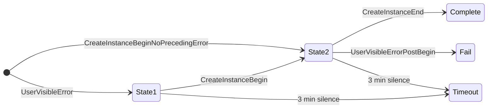
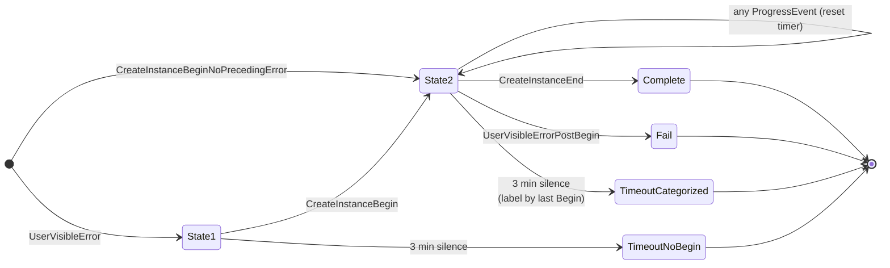

# Telemetry State Machine Updates

Backend changes required to consume the new Begin/End telemetry events added to `CreateInstance`. Without these changes, the new events are ignored and the existing `timeout` bucket does not shrink.

## Problem

Today the backend classifies each `CreateInstance` attempt using a 2-state machine with three events:

- `CreateInstanceBegin` (or `CreateInstanceBeginNoPrecedingError`)
- `CreateInstanceEnd` → **complete**
- `UserVisibleErrorPostBegin` → **fail**
- 3 min silence → **timeout**

The `timeout` bucket mixes two very different failures:

- **Real hangs** — code stuck in an `INFINITE`-timeout receive / plugin callback.
- **Slow but successful** — startup eventually succeeds past the 3-min window (e.g. HNS takes 3+ min).

Both collapse into the same opaque label, making triage impossible.

## New events

The client PR adds 15 Begin/End pairs between `CreateInstanceBegin` and `CreateInstanceEnd`. All carry `PDT_ProductAndServicePerformance`, key identifiers (`vmId` / `distroName` / `instanceId`), and the End variant carries an `hr` HRESULT for error attribution.

| Phase | Events | Typical cause of hang |
|---|---|---|
| VM lifecycle | `HcsCreateSystem*`, `HcsStartSystem*` | HCS service unresponsive |
| VM boot | `WaitForMiniInitConnect*`, `ReadGuestCapabilities*` | Kernel boot / hvsocket broken |
| Networking | `ConfigureNetworking*`, `CreateNatNetwork*` | HNS slow (common false-positive source) |
| VM finalize | `InitializeGuest*` | Guest config message stuck |
| Instance disk | `AttachDistroVhd*` | VHD attach on bad / BitLocker storage |
| Instance launch | `SendLaunchInit*`, `WaitForInitDaemonConnect*` | hvsocket write / guest init start |
| Instance init | `WaitForCreateInstanceResult*` | ext4 mount / journal recovery |
| Instance init | `WaitForDrvFsInit*` | Plan9 / virtiofs setup |
| Instance init | `WaitForInitConfigResponse*` | systemd startup |
| Plugins | `PluginOnVmStarted*`, `PluginOnDistroStarted*` | 3rd-party plugin (e.g. Docker Desktop) |

## Required backend changes

### 1. Reset the 3-min timer on any progress event (required)

All 30 new events must be registered as **progress events**. Receiving any of them in state 2 resets the 3-min silence timer without transitioning state.

### 2. Split the timeout bucket by last Begin event (required)

When state 2 times out, emit a sub-label based on the last `*Begin` observed with no matching `*End`.

Mapping from last `*Begin` (no matching End) → timeout sub-label:

| Last Begin | Timeout sub-label | Root cause |
|---|---|---|
| *(none)* | `Timeout_EarlyHang` | Stuck before any VM work |
| `HcsCreateSystemBegin` | `Timeout_HcsCreate` | HCS service unresponsive |
| `HcsStartSystemBegin` | `Timeout_HcsStart` | HCS start hung |
| `WaitForMiniInitConnectBegin` | `Timeout_KernelBoot` | Kernel / hvsocket broken |
| `ReadGuestCapabilitiesBegin` | `Timeout_GuestCaps` | mini_init not responding |
| `ConfigureNetworkingBegin` (no `CreateNatNetworkBegin`) | `Timeout_NetworkConfig` | GNS or other net init |
| `CreateNatNetworkBegin` | `Timeout_Hns` | HNS slow / wedged (often false positive) |
| `InitializeGuestBegin` | `Timeout_InitializeGuest` | Guest config stuck |
| `AttachDistroVhdBegin` | `Timeout_AttachVhd` | VHD attach failed |
| `SendLaunchInitBegin` | `Timeout_SendLaunchInit` | hvsocket write stuck |
| `WaitForInitDaemonConnectBegin` | `Timeout_InitDaemonConnect` | init not coming up |
| `WaitForCreateInstanceResultBegin` | `Timeout_InitMount` | ext4 mount / journal recovery |
| `WaitForDrvFsInitBegin` | `Timeout_DrvFs` | Plan9 / virtiofs setup |
| `WaitForInitConfigResponseBegin` | `Timeout_InitConfigResp` | systemd startup stuck |
| `PluginOnVmStartedBegin` | `Timeout_PluginOnVm` | (attach `Plugin` name) |
| `PluginOnDistroStartedBegin` | `Timeout_PluginOnDistro` | (attach `Plugin` name) |

### 3. Exception safety — `hr != S_OK` is not a hang

The client uses `WslTelemetryScope` RAII so an End event is always emitted, even on exception. The backend should treat this as three distinct outcomes:

| Observed | Meaning |
|---|---|
| `Begin` + `End` with `hr == S_OK` | Step succeeded |
| `Begin` + `End` with `hr != S_OK` | Step failed, error surfaced — **not** a hang |
| `Begin` with no `End` observed | Real silent hang → feeds timeout categorization |
