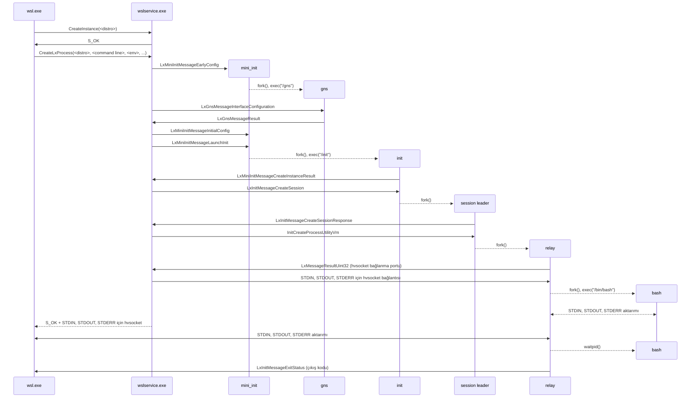

# WSL2 Başlatma Süreci

Bu sayfa, kullanıcının [wsl.exe](wsl.exe.md)'yi çağırmasından WSL2 dağıtımında bir Linux kabuğu (örnekte bash) başlatılana kadar geçen WSL2 sürecinin adımlarını açıklar.

## Genel Bakış 

Aşağıdaki diyagram, bir WSL2 dağıtımı içerisinde bash'in başlatılması için gerçekleşen olay sırasını gösterir. Her bir sürecin ne yaptığı hakkında ayrıntılar için [WSL architecture](index.md) sayfasına bakın.

## CreateInstance()

[wslervice.exe](wslservice.exe.md), COM aracılığıyla CreateInstance() çağrısını aldığında:

1) Kullanıcının başlatmak istediği dağıtımı tanımlar. Bu, Windows kayıt defterindeki `DistributionRegistration` girdisine (bkz. `src/windows/service/exe/DistributionRegistration.cpp`) bakılarak yapılır.

2) Dağıtım türüne göre (WSL1 veya WSL2), ya bir WSL1 örneği oluşturur ya da bir WSL2 sanal makinesi başlatır.

3) Oluşturulan dağıtımı çağıran işlemle ilişkilendirir (bkz. `src/windows/service/exe/Lifetime.cpp`)

## WSL2 Sanal Makinesini Başlatmak

Bir WSL2 dağıtımını başlatmak için, [wslservice.exe](wslservice.exe.md)'nin bir sanal makineye ihtiyacı vardır. Sanal makine zaten çalışmıyorsa, `CreateInstance()` çağrısının bir parçası olarak oluşturulur.

WSL2 sanal makinesi [Host Compute System (HCS) servisi](https://learn.microsoft.com/virtualization/api/hcs/overview) kullanılarak oluşturulur. (bkz. `src/windows/service/exe/WslCoreVm.cpp`).

Yeni bir sanal makine oluşturmak için, [wslservice.exe](wslservice.exe.md) sanal makine yapılandırmasını tanımlayan bir JSON dizesi üretir. Bu JSON [HcsCreateComputeSystem()](https://learn.microsoft.com/virtualization/api/hcs/reference/hcscreatecomputesystem) fonksiyonuna aktarılır.

HCS JSON şeması hakkında daha fazla ayrıntı için `src/windows/common/hcs_schema.h` dosyasına bakın.

WSL yapılandırmasında belirtilen bazı bileşenler:

- Çekirdek: WSL, genellikle `C:/Program Files/WSL/tools/kernel` yüklü yerleşik çekirdeğini veya [.wslconfig](https://learn.microsoft.com/windows/wsl/wsl-config) aracılığıyla geçersiz kılınmışsa özel bir çekirdeği kullanacaktır.
- Initramfs: WSL kendi initramfs'ını kullanır (genellikle `C:\Program Files\WSL\tools\initrd.img` dosyasına yüklenir). Yalnızca [mini_init](mini_init.md) ikili dosyasını içeren bir görüntüdür
- CPU, RAM, GPU, vb. gibi sanal makinenin erişebileceği kaynaklar

Sanal makine başlatıldığında, sağlanan çekirdeğe önyükleme yapacak ve ardından [mini_init](mini_init.md) komutunu çalıştıracaktır.

## Linux önyükleme süreci

[mini_init](mini_init.md) sanal makine içinde usermode başlatma işlemini gerçekleştiren süreçtir. Çeşitli yapılandırmaları gerçekleştirdikten sonra, `mini_init` [wslservice.exe](wslservice.exe.md)'den aşağıdaki bilgileri içeren bir `LxMiniInitMessageEarlyConfig` mesajı alır: 

- Sistem VHD'si, takas VHD'si ve varsa çekirdek modülleri VHD'si için tanımlayıcılar
- Makinenin ana bilgisayar adı
- Yapılandırılmış bellek geri kazanım modu ve sayfa raporlama sırası (Bkz. [wsl2.pageReporting](https://learn.microsoft.com/windows/wsl/wsl-config))*

[mini_init](mini_init.md) daha sonra ağ yapılandırmasından sorumlu olan [gns process](gns.md)'i oluşturur ve ardından aşağıdakileri içeren bir `LxMiniInitMessageInitialConfig` mesajı alır: 

- Sanal makinenin entropisini tohumlamak için bir entropi tamponu
- Varsa, monte edilecek GPU sürücü paylaşımları hakkında bilgi
- [wslg](https://github.com/microsoft/wslg) etkin olup olmadığı

[wslservice.exe](wslservice.exe.md) tarafından istenen tüm yapılandırmayı uyguladıktan sonra, sanal makine Linux dağıtımlarını başlatmaya hazırdır.

## Bir Linux dağıtımı başlatmak

Yeni bir dağıtım başlatmak için, [wslservice.exe](wslservice.exe.md) [mini_init](mini_init.md)'e bir `LxMiniInitMessageLaunchInit` mesajı gönderir, bu mesaj daha sonra dağıtım vhd'sini bağlar ve [init](init.md)'i başlatır. WSL2 dağıtımları yapılandırması hakkında daha fazla ayrıntı için bkz ([init](init.md)).

[wslservice.exe](wslservice.exe.md) çalıştıktan sonra, bu dağıtım içinde linux süreçlerini başlatmak için kullanılabilecek yeni bir [session leader](session-leader.md) başlatmak için bir `LxInitMessageCreateSession` mesajı gönderebilir.

## Linux sürecinin girdi ve çıktılarının Windows'a aktarılması

Kullanıcının linux süreci oluşturulduktan sonra, [wslservice.exe](wslservice.exe.md) `CreateLxProcess()`'ten [wsl.exe](wsl.exe.md)'ye geri dönebilir. WSL2 durumunda, [wsl.exe] (wsl.exe.md) aşağıdaki ELLERİ alır:

- STDIN
- STDOUT
- STDERR
- Kontrol kanalı
- İnterop kanalı

`STDIN`, `STDOUT` ve `STDERR` tanıtıcıları Linux sürecinden Windows terminaline girdi ve çıktı aktarmak için kullanılır. Tutamacın türüne bağlı olarak (terminal, boru, dosya, ...), [wsl.exe](wsl.exe.md) Windows ve Linux arasında en iyi uyumluluğu elde etmek için farklı aktarım mantıkları (bkz. `src/windows/common/relay.cpp`) uygulayacaktır.

Kontrol kanalı, Linux sürecine terminaldeki bir değişikliği bildirmek için kullanılır (örneğin [wsl.exe'nin](wsl.exe.md) terminal penceresi yeniden boyutlandırıldığında), böylece bu değişiklikler Linux sürecine de uygulanabilir.

İnterop kanalının iki kullanımı vardır:

- Linux'tan Windows süreçleri oluşturma (bkz. [interop](interop.md))
- Linux süreci çıktığında [wsl.exe](wsl.exe.md)'yi bilgilendirin (bkz. `LxInitMessageExitStatus`)

Linux süreci çıktıktan sonra, [wsl.exe](wsl.exe.md) kalan tüm IO'yu temizler ve Linux süreciyle aynı çıkış koduyla çıkar.

[wsl.exe](wsl.exe.md) Linux süreci çıkmadan önce sonlandırılırsa, [wslhost.exe](wslhost.exe.md) `Interop kanalını' devralır ve Windows süreçlerini yürütmek için istekleri işlemeye devam eder.