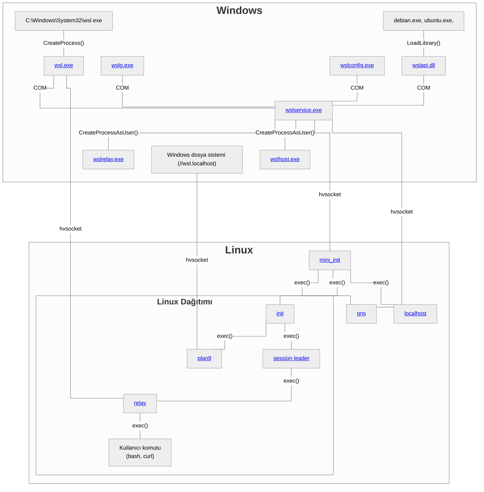

# WSL Genel Bakış

WSL, çeşitli yürütülebilir dosyalardan, API'lerden ve protokollerden oluşur. Bu sayfa, bileşenlerin genel yapısını ve birbirleriyle nasıl bağlantılı olduklarını özetler.

Her bir bileşen hakkında daha fazla bilgi almak için üzerine tıklayabilirsiniz.

